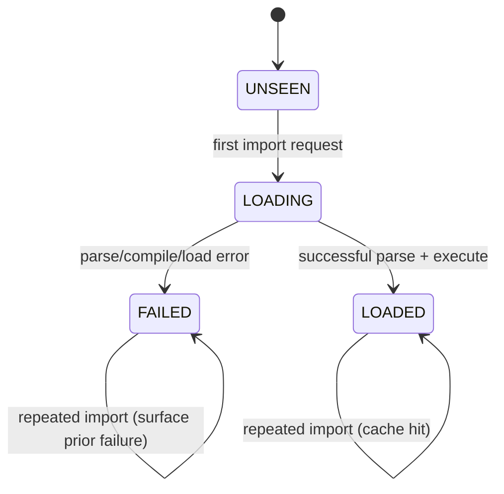
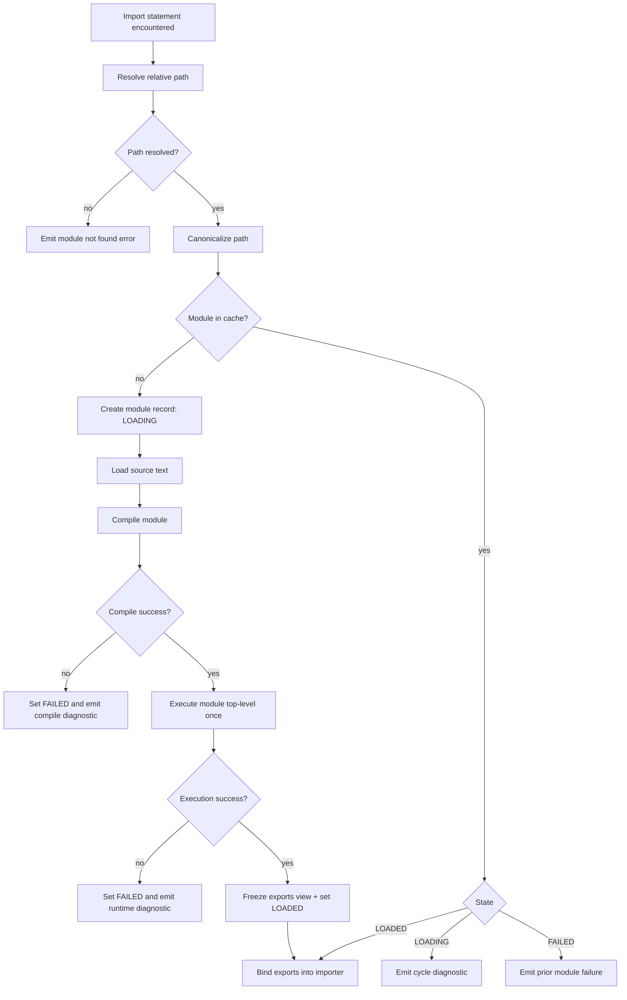

# Cellox Modules and Imports Implementation Plan

## Status

- Status: Ready for implementation
- Based on: module_imports_design_spec.md and module_imports_decision_matrix.md
- Policy bundle: A1, B1, C1, D1, E1

## Implementation Scope (Phase 1)

- Relative-path module imports only.
- Explicit exports only.
- Named imports and namespace imports.
- Single module evaluation per process.
- Cycle rejection with explicit chain diagnostics.
- No default export support.

## Out of Scope (Phase 1)

- Package manager support.
- Configurable module roots.
- Dynamic import strings.
- Conditional imports.
- Network imports.

## High-Level Architecture Changes

### Compiler Frontend

- Add import and export syntax recognition.
- Extend declaration parsing with module-aware forms.
- Validate export declarations and imported-name collisions.
- Emit module metadata required for loading and binding.

### Initializer and Program Entrypoint

- Treat the main file as a module root.
- Initialize module loader context before first compilation.
- Route import requests through module resolver and cache.

### Runtime and VM

- Add module registry/cache with execution state tracking.
- Bind imported exports into importer scope.
- Create namespace import objects that expose exported names.

### Diagnostics

- Add dedicated error class/category for module errors.
- Include importer file and imported file in error messages.
- Report cycle chains in human-readable order.

## Core Data Model (C-Oriented Plan)

```c
typedef enum {
    MODULE_STATE_UNSEEN,
    MODULE_STATE_LOADING,
    MODULE_STATE_LOADED,
    MODULE_STATE_FAILED
} module_state_t;

typedef struct {
    object_string_t* canonicalPath;
    module_state_t state;
    value_hash_table_t exportedBindings;
    bool initialized;
} module_record_t;

typedef struct {
    value_hash_table_t moduleCache;      // canonicalPath -> module_record_t*
    dynamic_value_array_t loadingStack;  // stack of canonicalPath for cycle diagnostics
} module_loader_t;
```

## Parser and Language Surface Plan

### Grammar Additions

```text
program          -> declaration* EOF ;
declaration      -> importDecl | exportDecl | existingDecl ;
importDecl       -> "import" importClause "from" STRING ";"
                  | "import" STRING ";" ;
importClause     -> IDENTIFIER
                  | "{" importList "}"
                  | "*" "as" IDENTIFIER ;
importList       -> IDENTIFIER ("," IDENTIFIER)* ;
exportDecl       -> "export" exportableDecl ;
exportableDecl   -> varDecl | funDecl | classDecl ;
```

### Semantic Constraints

- Only explicit `export` contributes to module public API.
- Import target must be a string literal.
- Duplicate exports in the same module are compile errors.
- Duplicate imported names in the same scope are compile errors.
- Importing non-exported symbols is a compile/load error.

## Resolver and Loader Plan

### Path Resolution Rules

- Resolve import path relative to importer module file directory.
- Normalize and canonicalize before cache lookup.
- Treat canonical path as module identity key.
- Fail early if file is missing or unreadable.

### Module State Machine



### Import Request Flow



### Cycle Detection Plan

```text
- Maintain loader.loadingStack as canonical path stack.
- On module load start: push current module path.
- Before loading dependency: check if dependency path is already in stack.
- If present: emit cycle error with stack slice + dependency.
- On module load end: pop current module path.
```

## Binding and Name Resolution Plan

### Named Imports

```c
// conceptual binding step
for each importedName in importClause.namedList {
    value_t exportedValue;
    if (!value_hash_table_get(&targetModule->exportedBindings, importedName, &exportedValue)) {
        report_module_error(importerPath, targetPath, "unknown exported name");
        fail_current_module();
    }
    bind_read_only_symbol_in_scope(currentCompilerScope, importedName, exportedValue);
}
```

### Namespace Imports

```c
object_instance_t* namespaceObject = object_new_instance(module_namespace_class());
for each (name, value) in targetModule->exportedBindings {
    set_namespace_field(namespaceObject, name, value);
}
bind_read_only_symbol_in_scope(currentCompilerScope, namespaceAlias, OBJECT_VAL(namespaceObject));
```

### Export Registration

```c
// called when compiling/exporting declarations
register_export_name(currentModuleRecord, exportName, exportValue);
```

## File and Component Work Plan

### Planned Parser/Lexer Touchpoints

- Token definitions for module keywords.
- Declaration parsing entry points for import and export declarations.
- Compile-time validation and diagnostics for module syntax and name collisions.

### Planned Runtime/Initializer Touchpoints

- Loader context initialization at startup.
- Module cache lifecycle integration with VM lifetime.
- Module load/execute/bind flow integrated into interpreter startup path.

### Planned Value/Object Touchpoints

- Namespace object representation using existing object/field mechanisms.
- Export table access through hash table APIs.

## Test Plan

### Unit Tests

- Resolver canonicalization behavior for relative inputs.
- Module state transitions for successful and failed loads.
- Cycle detection with short and long chains.
- Export table duplicate prevention.

### Integration Tests

- Multi-file named import success.
- Namespace import success.
- Repeated import executes imported module only once.
- Import unknown export fails with expected diagnostic.
- Import missing file fails with expected diagnostic.
- Two-module and three-module cycle diagnostics contain full chain.

### End-to-End Tests

- Real program split across modules runs correctly.
- Class/function/variable exports consumed by importing modules.
- Mixed imports in nested directories.

### Fuzz / Property Tests

- Random acyclic module graphs validate deterministic load order and cache behavior.
- Random invalid import graph generation validates robust diagnostics without crashes.

## Milestones

1. Milestone 1: Language surface and parser acceptance

- Import/export syntax parsed.
- Basic diagnostics for invalid forms.

1. Milestone 2: Resolver and module cache

- Canonical path identity and cache semantics.
- State machine behavior with deterministic errors.

1. Milestone 3: Binding and execution semantics

- Named and namespace import bindings.
- Single execution semantics validated.

1. Milestone 4: Diagnostics and hardening

- Cycle diagnostics quality.
- Missing module and unknown export diagnostics.
- Regression suite expansion.

1. Milestone 5: Documentation and rollout

- README and language docs update.
- Changelog entry and migration notes.

## Rollout Guardrails

- Keep feature behind staged delivery branch until test matrix is green.
- Require sanitizer and coverage runs before merge.
- Block release if cycle diagnostics are ambiguous or if repeated imports rerun side effects.

## Acceptance Checklist

- Import/export semantics match agreed policy bundle.
- Module cache enforces single top-level execution per canonical module path.
- Cycles are rejected with complete chain diagnostics.
- Test suites pass for unit, integration, e2e, and fuzz labels.
- Sanitizer runs pass without new issues.
- Coverage includes module loader and parser behavior paths.
