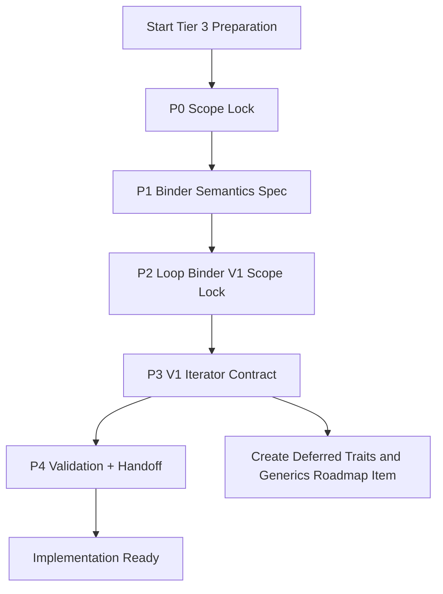
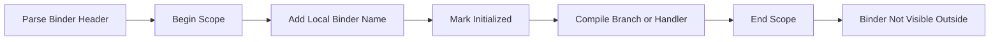
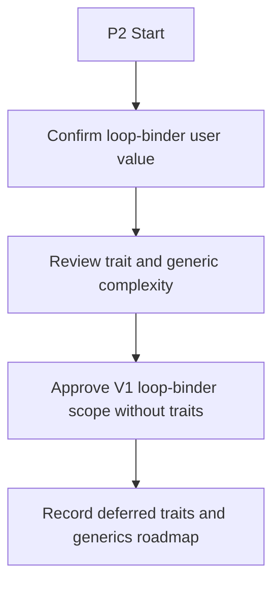
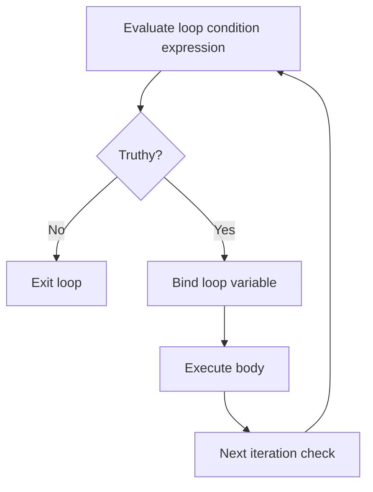
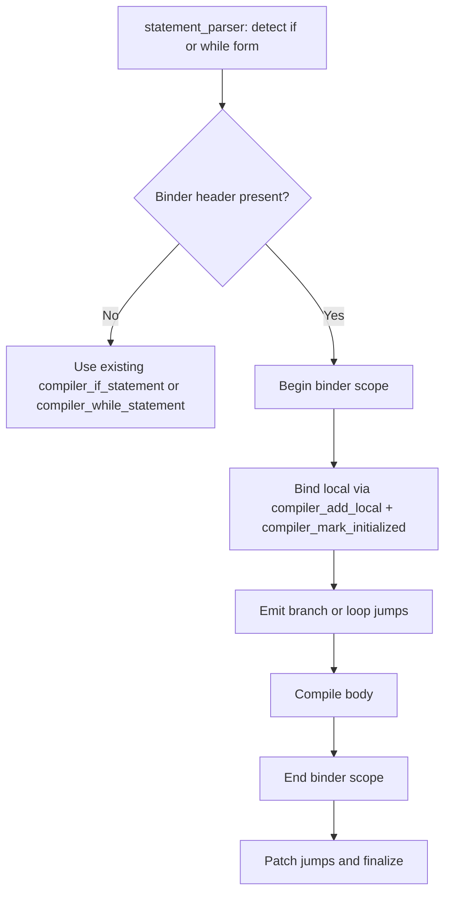

# Tier 3 Preparation Implementation Plan

## Purpose

This plan defines the concrete preparation work required before implementing Tier 3 binder features.

It turns the design document into executable planning tasks, decision gates, and review artifacts.

## Inputs

- `docs/tier3_preparation_design.md`
- `docs/tier3_implementation_plan.md`
- Existing Tier 1 and Tier 2 binder behavior and tests

## Preparation Outcomes

Preparation is complete when all of the following are approved:

1. Binder semantics decision pack
2. Conditional plus loop-binder V1 scope decision
3. V1 iterator contract decision (no traits)
4. Test acceptance matrix for each active phase
5. Updated grammar and docs scope for implementation handoff
6. Deferred roadmap note for iterator traits and generics

## Codebase Alignment Notes

The preparation and pseudocode below are aligned to the current frontend structure:

- Statement control-flow parsing: `src/frontend/src/parsing/statement_parser.c`
- Expression/error binder parsing: `src/frontend/src/parsing/expression_parser.c`
- Existing binder precedent to reuse: `compiler_iferror_statement()` and `expression_parser_parse_pipe_bound_handler()`
- Existing jump/scope helpers already used in control flow:
   - `compiler_emit_jump()`, `compiler_patch_jump()`, `compiler_emit_loop()`
   - `compiler_begin_scope()`, `compiler_end_scope()`, `compiler_add_local()`, `compiler_mark_initialized()`
- Existing result opcodes already used by binder-like error flow:
   - `OP_RESULT_IS_ERROR`, `OP_RESULT_UNWRAP`, `OP_RESULT_UNWRAP_ERROR`

## Preparation Flow Diagram



## Work Breakdown

## P0: Scope Lock And Baseline

### Goals

- Freeze what Tier 3 preparation includes and excludes.
- Confirm no hidden dependency from unfinished Tier 1/2 items.

### Tasks

1. Reconfirm in-scope and out-of-scope items from preparation design.
2. Record current parser/runtime assumptions that Tier 3 depends on.
3. Create a short dependency list for implementation handoff.

### Deliverables

- Scope lock note
- Dependency checklist

### Exit Criteria

- Scope and assumptions accepted by maintainers.

## P1: Binder Semantics Specification

### Goals

- Finalize common binder semantics shared by conditional and loop forms.

### Tasks

1. Define binder lifetime and scope boundaries.
2. Define single-evaluation guarantees for bound source expressions.
3. Define shadowing and nested binder behavior.
4. Define diagnostic rules for malformed binder usage.

### Deliverables

- Binder semantics table (rules + examples)
- Diagnostics list (error condition -> message intent)

### Exit Criteria

- No unresolved semantic contradictions.

### Pseudocode (Semantics Extraction)

```text
function prepare_p1_binder_semantics():
   semantics = {}

   semantics.scope_rules = derive_from(
      compiler_iferror_statement,
      expression_parser_parse_pipe_bound_handler
   )

   semantics.eval_once_rules = derive_from(
      compiler_if_statement,
      compiler_while_statement,
      expression_parser_catch
   )

   semantics.diagnostics = collect_invalid_forms([
      missing_pipe,
      missing_identifier,
      missing_else_for_required_form,
      binder_outside_scope_use
   ])

   return semantics
```

### Mermaid (Binder Scope/Lifetime Rule)



## P2: Loop Binder V1 Scope Lock

### Goals

- Explicitly lock Tier 3 scope to conditional binders plus while-loop binders.
- Keep iterator traits/generics out of V1 scope.

### Tasks

1. Record rationale for loop binders in V1 without traits.
2. Document why traits/generics are deferred (complexity/risk).
3. Document the accepted V1 limitation: custom types use adapter iterators for now.
4. Produce final decision record.

### Deliverables

- Scope decision record (approved)
- Updated rollout order

### Exit Criteria

- Conditional plus loop-binder V1 scope is explicitly approved.

### Pseudocode (Scope Gate)

```text
function prepare_p2_scope_lock():
   decision = {
      tier3_scope: "conditional_and_loop_binders_v1",
      include_while_binder: true,
      include_iter_next_patterns: true,
      defer_iterator_traits: true,
      defer_generics: true,
      rationale: [
         "loop binders provide immediate value",
         "traits and generics are easy to overdesign",
         "adapter iterators are acceptable as an interim model"
      ]
   }

   record_decision(decision)
   return decision
```

### Mermaid (Scope Decision Logic)



## P3: V1 Iterator Contract (No Traits)

### Goals

- Define a minimal iterator contract usable in loops without trait/generic machinery.

### Tasks

1. Define completion signaling for loop conditions (falsey stop rule).
2. Define recommended pattern: while (iter.next()) |item| { ... }.
3. Define array helper behavior and adapter expectations for other types.
4. Define diagnostics expectations when iterator adapter contracts are violated.

### Deliverables

- V1 iterator contract note
- Adapter iterator guidance
- Deferred roadmap note for traits and generics

### Exit Criteria

- V1 loop semantics and iterator contract are internally consistent and approved.

### Pseudocode (Iterator Contract)

```text
function prepare_p3_iterator_contract():
   contract = {
      loop_form: "while (expr) |item| stmt",
      eval_rule: "expr evaluated once per iteration check",
      bind_rule: "item bound only when expr is truthy",
      stop_rule: "loop exits when expr is falsey",
      array_path: "provide array iterator helper",
      custom_path: "custom types use adapter with next()"
   }

   if defer_iterator_traits:
      create_roadmap_item("traits_generics_iteration", {
         goal: "remove adapter friction for user-defined iterable types"
      })

   return contract
```

### Mermaid (Loop Contract Flow)



## P4: Validation And Handoff Package

### Goals

- Prepare a complete implementation handoff with acceptance criteria for active Tier 3 scope.

### Tasks

1. Build phase-by-phase test matrix:
   - Phase A: conditional binder cases
   - Phase B: while-loop binder cases
   - Phase C: typed and pattern binder cases
2. Define regression suite requirements for existing syntax.
3. Align grammar/doc updates with implementation milestones.
4. Produce handoff checklist for parser/lowering work.

### Deliverables

- Tier 3 preparation acceptance matrix
- Implementation handoff checklist
- Final updated planning docs

### Exit Criteria

- Handoff package approved and implementation can start without open design blockers.

## Implementation-Oriented Pseudocode Appendix

These snippets are preparation-grade pseudocode that mirror existing compiler flow in the current codebase.

### A. Conditional Binder Form Preparation

```text
function prep_shape_if_binder_statement():
   // target location: compiler_if_statement in statement_parser.c
   consume(TOKEN_LEFT_PAREN)
   parse_expression()           // existing expression_parser_parse_expression
   consume(TOKEN_RIGHT_PAREN)

   if match(TOKEN_PIPE):
      binder = parse_pipe_identifier()
      thenJump = emit_jump(OP_JUMP_IF_FALSE)
      emit(OP_POP)

      begin_scope()
      add_local(binder)
      mark_initialized()
      compile_statement_or_block()
      end_scope()

      elseJump = emit_jump(OP_JUMP)
      patch_jump(thenJump)
      emit(OP_POP)
      compile_optional_else()
      patch_jump(elseJump)
   else:
      lower_existing_if_path()
```

### B. Loop Binder Form Preparation (V1)

```text
function prep_shape_while_binder_statement():
   // target location: compiler_while_statement in statement_parser.c
   loopStart = current_offset()
   consume(TOKEN_LEFT_PAREN)
   parse_expression()
   consume(TOKEN_RIGHT_PAREN)

   if match(TOKEN_PIPE):
      binder = parse_pipe_identifier()
      exitJump = emit_jump(OP_JUMP_IF_FALSE)
      emit(OP_POP)

      begin_scope()
      add_local(binder)
      mark_initialized_with(condition_value)
      compile_statement_or_block()
      end_scope()

      emit_loop(loopStart)
      patch_jump(exitJump)
      emit(OP_POP)
   else:
      lower_existing_while_path()
```

### C. Deferred: Traits and Generics Iteration (Future)

Traits/generics are intentionally deferred in V1.

Future goal:

- Remove per-type adapter friction.
- Support user-defined iterable types through a common protocol.

### Mermaid (Compilation Program Flow)



## Timeline Template

Use this template as a planning baseline:

1. Week 1:
   - P0 and P1 complete
2. Week 2:
   - P2 scope lock complete
   - P3 iterator contract complete
3. Week 3:
   - P4 validation package complete and signed off

## RACI Template

1. Language owner: semantics decisions and final approvals
2. Compiler maintainer: parser/lowering feasibility review
3. Runtime maintainer: V1 iterator behavior and deferred trait/generic boundary review
4. Test owner: acceptance matrix and regression coverage ownership

## Risk Register

1. Scope creep from adding pattern semantics too early
   - Mitigation: keep typed/pattern work syntax-first until Phase D
2. V1 iterator model may require per-type adapters
   - Mitigation: provide array helper plus clear adapter guidance
3. Trait/generic contract instability (deferred risk)
   - Mitigation: keep out of active scope until V1 loop semantics settle
4. Regression in existing control-flow lowering
   - Mitigation: require targeted regression suite in P4

## Checklists

## Preparation Completion Checklist

- [ ] P0 scope lock approved
- [ ] P1 binder semantics approved
- [ ] P2 conditional plus loop-binder V1 scope approved
- [ ] P3 iterator contract approved
- [ ] P4 acceptance matrix approved
- [ ] Handoff package approved

## Implementation Readiness Checklist

- [ ] Syntax decisions are frozen for next implementation phase
- [ ] Semantic rules have runnable examples
- [ ] Diagnostics policy is documented
- [ ] Test acceptance matrix is mapped to concrete test files
- [ ] Rollback/feature-flag strategy is documented
